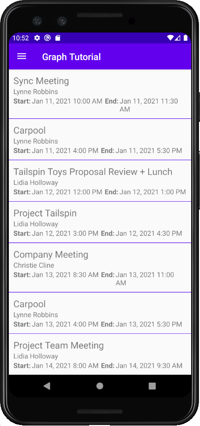

<!-- markdownlint-disable MD002 MD041 -->

在此练习中，你将 Microsoft Graph 合并到应用程序中。 对于此应用程序，你将使用 Microsoft [Graph SDK for Java](https://github.com/microsoftgraph/msgraph-sdk-java) 调用 Microsoft Graph。

## <a name="get-calendar-events-from-outlook"></a>从 Outlook 获取日历事件

在此部分中，您将扩展类以添加一个函数，获取当前一周的用户事件，并 `GraphHelper` 更新为 `CalendarFragment` 使用这些新函数。

1. 打开 **GraphHelper，** 将以下 `import` 语句添加到文件顶部。

    ```java
    import com.microsoft.graph.options.Option;
    import com.microsoft.graph.options.HeaderOption;
    import com.microsoft.graph.options.QueryOption;
    import com.microsoft.graph.requests.extensions.IEventCollectionPage;
    import com.microsoft.graph.requests.extensions.IEventCollectionRequestBuilder;
    import java.time.ZonedDateTime;
    import java.time.format.DateTimeFormatter;
    import java.util.LinkedList;
    import java.util.List;
    ```

1. 将以下函数添加到 `GraphHelper` 类。

    :::code language="java" source="../demo/GraphTutorial/app/src/main/java/com/example/graphtutorial/GraphHelper.java" id="GetEventsSnippet":::

    > [!NOTE]
    > 考虑代码正在 `getCalendarView` 执行哪些工作。
    >
    > - 将调用的 URL 为 `/v1.0/me/calendarview` 。
    >   - 和 `startDateTime` `endDateTime` 查询参数定义日历视图的开始和结束。
    >   - 标头使 Microsoft Graph 返回用户时区中每个事件的开始时间 `Prefer: outlook.timezone` 和结束时间。
    >   - `select`该函数将每个事件返回的字段限制为仅视图将实际使用的字段。
    >   - 该 `orderby` 函数按开始时间对结果进行排序。
    >   - 该 `top` 函数每页请求 25 个结果。
    > - 定义回调 () 检查是否有更多结果 `pagingCallback` 可用，并根据需要请求其他页面。

1. 右键单击 **app/java/com.example.graphtu一l** 文件夹，然后选择"新建 **"，Java类**。 命名类 `GraphToIana` ，然后选择"**确定"。**

1. 打开新文件，并将其内容替换为以下内容。

    :::code language="java" source="../demo/GraphTutorial/app/src/main/java/com/example/graphtutorial/GraphToIana.java" id="GraphToIanaSnippet":::

1. 将以下 `import` 语句添加到 **CalendarFragment** 文件的顶部。

    ```java
    import android.util.Log;
    import android.widget.ListView;
    import com.google.android.material.snackbar.BaseTransientBottomBar;
    import com.google.android.material.snackbar.Snackbar;
    import com.microsoft.graph.concurrency.ICallback;
    import com.microsoft.graph.core.ClientException;
    import com.microsoft.graph.models.extensions.Event;
    import com.microsoft.identity.client.AuthenticationCallback;
    import com.microsoft.identity.client.IAuthenticationResult;
    import com.microsoft.identity.client.exception.MsalException;
    import java.time.DayOfWeek;
    import java.time.ZoneId;
    import java.time.ZonedDateTime;
    import java.time.temporal.ChronoUnit;
    import java.time.temporal.TemporalAdjusters;
    import java.util.List;
    ```

1. 将以下成员添加到 `CalendarFragment` 类。

    ```java
    private List<Event> mEventList = null;
    ```

1. 将以下函数添加到 `CalendarFragment` 类中以隐藏和显示进度栏。

    :::code language="java" source="../demo/GraphTutorial/app/src/main/java/com/example/graphtutorial/CalendarFragment.java" id="ProgressBarSnippet":::

1. 添加以下函数，为中的 `getCalendarView` 函数提供回调 `GraphHelper` 。

    ```java
    private ICallback<List<Event>> getCalendarViewCallback() {
        return new ICallback<List<Event>>() {
            @Override
            public void success(List<Event> eventList) {
                mEventList = eventList;

                // Temporary for debugging
                String jsonEvents = GraphHelper.getInstance().serializeObject(mEventList);
                Log.d("GRAPH", jsonEvents);

                hideProgressBar();
            }

            @Override
            public void failure(ClientException ex) {
                hideProgressBar();
                Log.e("GRAPH", "Error getting events", ex);
                Snackbar.make(getView(),
                    ex.getMessage(),
                    BaseTransientBottomBar.LENGTH_LONG).show();
            }
        };
    }
    ```

1. 将类 `onCreateView` 中的现有 `CalendarFragment` 函数替换为以下内容。

    :::code language="java" source="../demo/GraphTutorial/app/src/main/java/com/example/graphtutorial/CalendarFragment.java" id="OnCreateViewSnippet":::

    请注意此代码执行什么功能。 首先，它调用 `acquireTokenSilently` 获取访问令牌。 每次需要访问令牌时调用此方法是一种最佳实践，因为它利用 MSAL 的缓存和令牌刷新功能。 在内部，MSAL 检查缓存令牌，然后检查其是否已过期。 如果令牌存在且未过期，它将仅返回缓存的令牌。 如果令牌已过期，它将尝试在返回令牌之前刷新令牌。

    检索令牌后，代码将调用该方法 `getCalendarView` ，获取用户的事件。

1. 运行应用、登录，然后点击菜单中的 **"** 日历"导航项。 你应该在 Android Studio 的调试日志中看到事件的 JSON 转储。

## <a name="display-the-results"></a>显示结果

现在，可以将 JSON 转储替换为某些内容，以用户友好的方式显示结果。 在此部分中，您将向日历片段添加一个，为每个项目创建一个布局，然后为将每个字段映射到视图中相应的字段的自定义列表 `ListView` `ListView` `ListView` `Event` `TextView` 适配器。

1. 将 `TextView` 应用 **/res/layout/fragment_calendar.xml** 替换为 `ListView` 。

    :::code language="xml" source="../demo/GraphTutorial/app/src/main/res/layout/fragment_calendar.xml" highlight="6-11":::

1. 右键单击 **应用/res/layout** 文件夹，然后选择 **"新建**"，然后选择 **"布局"资源文件**。

1. 命名文件 `event_list_item` ，将 **根元素更改为** `RelativeLayout` ，然后选择 **"确定"。**

1. 打开 **event_list_item.xml** 文件，并将其内容替换为以下内容。

    :::code language="xml" source="../demo/GraphTutorial/app/src/main/res/layout/event_list_item.xml":::

1. 右键单击 **app/java/com.example.graphtu一l** 文件夹，然后选择"新建 **"，Java类**。

1. 命名类 `EventListAdapter` ，然后选择"**确定"。**

1. 打开 **EventListAdapter** 文件，并将其内容替换为以下内容。

    :::code language="java" source="../demo/GraphTutorial/app/src/main/java/com/example/graphtutorial/EventListAdapter.java" id="EventListAdapterSnippet":::

1. 打开 **CalendarFragment** 类，将以下函数添加到该类。

    :::code language="java" source="../demo/GraphTutorial/app/src/main/java/com/example/graphtutorial/CalendarFragment.java" id="AddEventsToListSnippet":::

1. 将替代中的临时调试 `success` 代码替换为 `addEventsToList();` 。

    :::code language="java" source="../demo/GraphTutorial/app/src/main/java/com/example/graphtutorial/CalendarFragment.java" id="SuccessSnippet" highlight="5":::

1. 运行应用、登录并点击 **日历导航** 项。 应看到事件列表。

    
